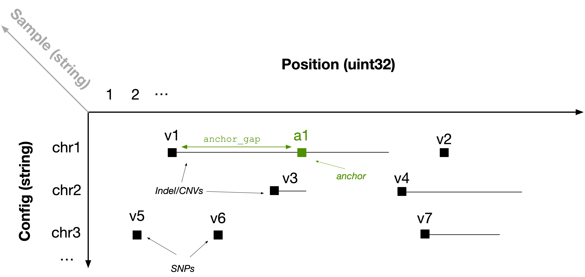
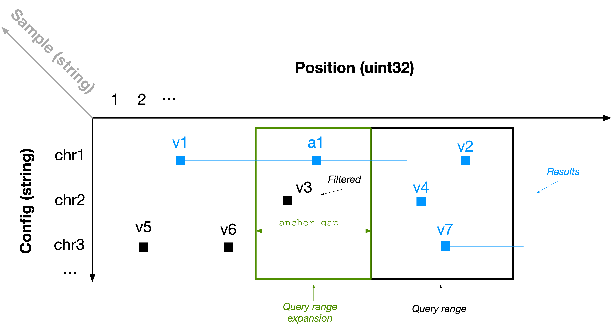

# The Solution

## Storing variants as 3D sparse arrays

Population variant data can be efficiently represented using a 3D sparse array. For each sample, imagine a 2D plane where the vertical axis is the contig and the horizontal axis is the genomic position. Every variant can be represented as a range within this plane; it can be unary \(i.e., a SNP\) or it can be a longer range \(e.g., INDEL or CNV\). Each sample is then indexed by a third dimension, which is unbounded to accommodate populations of any size. The figure below shows an example for one sample, with several variants distributed across contigs `chr1` , `chr2` and `chr3`.

In TileDB-VCF, we represent the _start_ position of each range as _a non-empty cell_ in a sparse array \(black squares in the above figure\). In each of those array cells, we store the _end_ position of each cell \(to create a range\) along with all other fields in the corresponding single-sample VCF files for each variant \(e.g., `REF`, `ALT`, etc.\). Therefore, for every sample, we map variants to 2D non-empty sparse array cells. 

To facilitate rapid retrieval of interval intersections \(explained in the next section\), we also inject _anchors_ \(green square in the above figure\) to breakup long ranges. Specifically, we create a new non-empty cell every `anchor_gap` bases from the start of the range \(where `anchor_gap` is a user-defined parameter\), which is identical to the range cell, except that \(1\) it has a new start coordinate and \(2\) it stores the real start position in an attribute.

Note that regardless of the number of samples, we do not inject any additional information other than that of the anchors, which is user configurable and turns out to be negligible for real datasets. In other words, this solution leads to _linear_ storage in the number of samples, thus being scalable. 

## Fast retrieval

The typical access pattern used for variant data involves one or more rectangles covering a set of genomic ranges across one or more samples. In the figure below, let the black rectangle be the user's query. Observe that the results are highlighted in blue \(`v1, v2, v4, v7`\). However, the rectangle misses `v1`, i.e., the case where an Indel/CNV range _intersects_ the query rectangle, but the start position is _outside_ the rectangle. 

This is the motivation behind _anchors_. TileDB-VCF expands the user's query range on the left by `anchor_gap`. It then reports as results the cells that are included in the expanded query if their end position \(stored in an attribute\) comes after the query range start endpoint. In the example above, TileDB-VCF retrieves anchor `a1` and Indel/CNV `v3`. It reports `v1` as a result \(as it can be extracted directly from anchor `a1`\), but filters out `v3`.

::: {.callout-note}
By representing each sample's variants as non-empty cells in a 2D plane and using anchors and expanded queries, we managed to model population variants as 3D sparse arrays and use the vanilla functionality of TileDB-Embedded, inheriting all its powerful features out of the box.
:::

Quite often, the analyses requires data retrieval based on numerous query ranges \(up to the order of millions\), which must be submitted simultaneously. TileDB-VCF leverages the highly optimized multi-range subarray functionality of TileDB Embedded, which leads to unparalleled performance for such scenarios.

_But what about updates?_ That's the topic of the next section.

## Updates

TileDB-VCF is based on TileDB Embedded which supports [rapid updates](https://docs.tiledb.com/main/background/internal-mechanics/writing) via [immutable fragments](https://docs.tiledb.com/main/background/key-concepts-and-data-format#fragments-1). That means that every time a new batch of samples is added to the 3D array, the previous contents of the array are not modified at all. Each batch write operation is totally independent and _lock-free—_any number of threads or processes can write simultaneously without synchronization, while ensuring consistency.  With TileDB-VCF, both update time and storage size scales linearly with the number of new samples, **solving the N+1 problem**.

## Easy and cost-efficient scaling

TileDB-VCF allows you to efficiently store, update and access enormous population genomic datasets, all _open-source_. And although it is a C++ embedded library \(which works on a single machine\), it also integrates very well with Spark and Dask, enabling you to scale your analysis to large clusters. However, the burden of managing clusters \(spinning them up, deploying the software, monitoring the resources, etc.\), falls entirely on you, which is quite an undertaking.

Enter TileDB Cloud! 

TileDB Cloud allows you to perform parallel ingestion and parallel slicing / processing, **100% serverless**. This means that you do not have to spin up large clusters or pay for idle time. You can easily slice data or define complex task flows comprised of thousands of tasks, which TileDB Cloud deploys elastically in its serverless infrastructure, providing an unmatched combination of ease of use and low cost on the cloud—even for your most challenging analyses.

## Collaboration

::: {.callout-note}
The shear volume of data generated by modern population genomics applications creates enormous challenges around data management and collaboration.
:::

TileDB Cloud offers groundbreaking features for collaborative genomic research:

1. Popular public datasets made available in the TileDB format for direct analysis
2. Easy mechanism for one to share their data and code \(Jupyter notebooks and user-defined functions\), either with a specific set of users or the entire world
3. Easy ways to explore and discover public data and code.

_Join our vision to build a growing community around open data and code!_

## What's next?

If you are familiar with the TileDB Embedded data model, you can delve into the technical details of how TileDB-VCF stores genomic variant data using [D sparse arrays. Otherwise you can proceed with [installation instructions](installation/) and tutorials.

